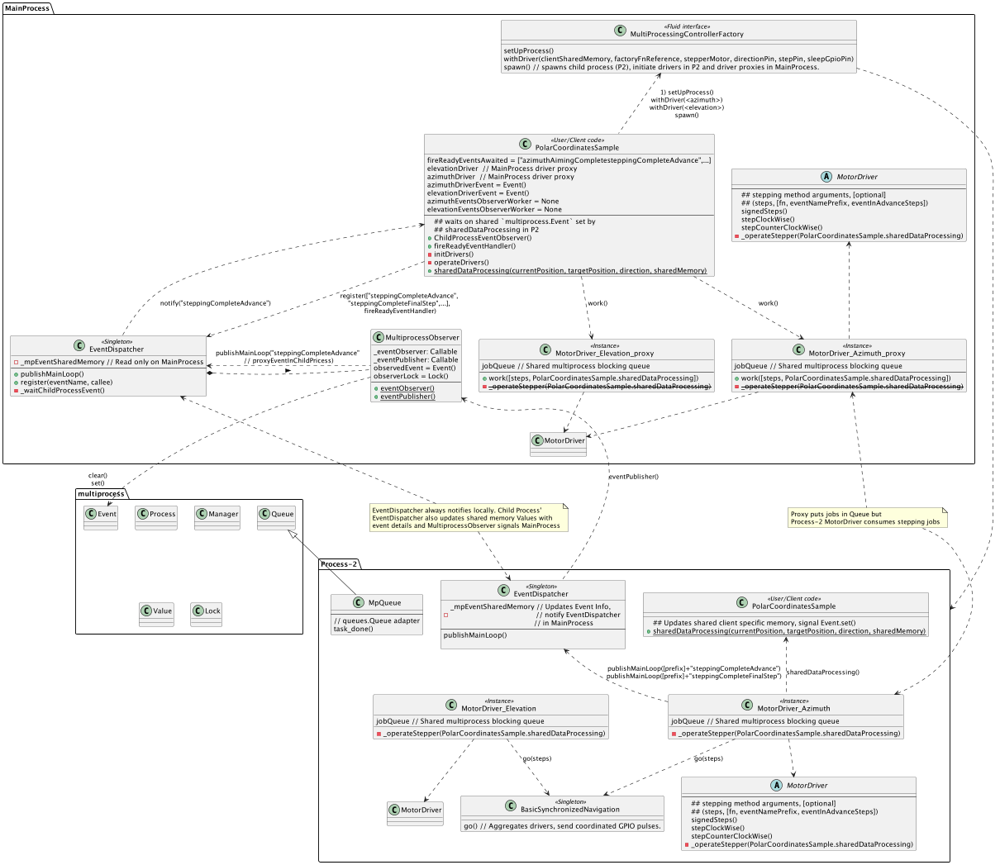

# Intro

Although Python and PC in general (RPI in particular) are not optimal for accurate timing of stepper motor pulses
(OS scheduler + Python sleep inaccuracies and, ATM, Global Interpreter Lock [GIL]), this library aims at providing
a versatile tool for managing a set of stepper motors (through their drivers) in several ways that might fit specific 
scenarios.

A few distinct concepts have been implemented:
* `Driver` (or Controller, used interchangeably), each instantiated driver will behave as a dedicated single thread worker
  (see `BlockingQueueWorker`) which receives steps jobs through a shared queue, in an attempt decouple steps timing 
  from the rest of the system, (here the GIL imposes some challenged in theory).
* `StepperMotor`, encapsulates the motor characteristics, like min and max PPS (pulses per second), and instantaneous  
  torque. A Generic motor is implemented that can be constructed with specifics in case of lacking implementation of  
  your motor (you are welcome to add it).
* `Navigation`, The driver can navigate from A to B, setting direction & sending pulses to the motor, statically (as in 
  a 3D printer scenario where planning is made up front), dynamically (for interactive or event based systems that
  need to quickly respond to unplanned speed and direction changes), or centrally synchronized for several motors ran 
  in choir (this is also dynamic).
* `AccelerationStrategies` or profiles, handle how to reach max speeds for the motor. Linear, Exponential & Custom (which
  takes motor's instantaneous torque or a list of transformations as input to max out your motor capabilities). Custom
  acceleration strategy has a pre-requisite that you use the Benchmark module (see bellow) to find optimal  
  transformations for your motor, in a production setup (proper load applied). All changes are effected as a function of
  current motor' speed in PPS. (other systems use curves as function of time. I found that impractical)
  * `DelayPlanners` (in tandem with Navigation modes) enable Drivers to handle inertia gracefully either in a static or 
    dynamic context. DelayPlanner implementations determine if it's time to start breaking, speeding up or stay steady.
    Acceleration strategies effect proper changes to speed. 
* `Benchmark`, a stress test module to find your motor's (under current load), min & max speeds, and instantaneous torque 
  characteristics, all in terms of PPS. For instantaneous torque characteristics the output (with format
  `[(minPPS, incrementPPS_1), (minPPS + incrementPPS_1, incrementPPS_2), ..., (maxPPS, 0)]`) can be
  used as `YourStepperMotorSubClass.TORQUE_CURVE` or as an input to `CustomAccelerationPerPps` acceleration 
  strategy's `transformations` constructor argument. This enables your motor to reach max speed in the least amount of 
  steps possible while keeping synch (useful when speed matters).
  * Currently tested on (see https://www.reddit.com/r/robotics/comments/18ukw4p/benchmarking_stepper_motor/):  
    * Raspberry Pi 4B with,
    * DRV8825 driver board
    * PG35S_D48_HHC2 stepper motor 
* `EventDispatcher` centralized events broker Drivers use to notify any subscriber if steppingComplete events, finalStep   
  or in advance (10 steps in advance by default). your app can also use it to publish and subscribe to app level events.  
  It's a neat way to allow for extension points without modifying working classes. In multiprocess scenario 
 `EventDispatcher` uses `MultiprocessObserver` to gain awareness of, and proxy events from, child dedicated process 
  running motor drivers, so in effect, driver events are (re)published in MainProcess where your app resides. 

## Implemented Drivers
The following table shows what driers have specific implementations, and vaguely their signaling specs, 
headers marker with * are concepts the MotorDriver base class knows about, 
Explicitly implemented Driver names are marked with ***Bolded**.
Driers that should work with implemented classes in _Italic_ 

| Driver                                                                                                                 | Step* (Pulse 20-50μs)                                       | Direction* | Enable*     | Sleep*      | Microstepping* (Number of Pins) | Fault        | Implemented  |
|------------------------------------------------------------------------------------------------------------------------|-------------------------------------------------------------|------------|-------------|-------------|---------------------------------|--------------|--------------|
| **DRV8825**                                                                                                            | 1-2μs (min)                                                 | HIGH/LOW   | ACTIVE LOW  | ACTIVE LOW  | 3 (2^3 = 8 modes)               | YES          | Yes          |
| **TMC2209**                                                                                                            | 1-2μs (min)                                                 | HIGH/LOW   | ACTIVE LOW  | NA          | 4 (2^4 = 16 modes)              | YES          | Yes          |
| _A4988_                                                                                                                | 1-2μs (min)                                                 | HIGH/LOW   | ACTIVE LOW  | ACTIVE LOW  | 3 (2^3 = 8 modes)               | NO           | Eq(DRV8825)  |
| TB6600                                                                                                                 | 1-2μs (min)                                                 | HIGH/LOW   | ACTIVE LOW  | ACTIVE LOW  | 3 (2^3 = 8 modes)               | YES          |              |
| TB6560                                                                                                                 | 1-2μs (min)                                                 | HIGH/LOW   | ACTIVE LOW  | ACTIVE LOW  | 3 (2^3 = 8 modes)               | YES          |              |
| _TMC2208_                                                                                                              | 1-2μs (min)                                                 | HIGH/LOW   | ACTIVE LOW  | NA          | 4 (2^4 = 16 modes)              | YES          | Eq(TMC2208)  |
| _TMC2226_                                                                                                              | 1-2μs (min)                                                 | HIGH/LOW   | ACTIVE LOW  | NA          | 4 (2^4 = 16 modes)              | YES          | Eq(TMC2208)  |
| _LV8729_                                                                                                               | 1-2μs (min)                                                 | HIGH/LOW   | ACTIVE LOW  | ACTIVE LOW  | 3 (2^3 = 8 modes)               | NO           | Eq(DRV8825)  |
| [L298N](https://forum.arduino.cc/t/stepper-motor-basics/275223) <td colspan=3> Not sure I'll implement a H-Bridge type |  
| ULN2003 <td colspan=3> Unipolar driers Not supported                                                                   |


## Demo

All motors driven by dedicated DRV8825.

### Demo with 2 steppers at 400PPS (0.2 Deg/step)

2 Steppers * 3 pins each (dir, step, sleep)

[](https://www.youtube.com/watch?v=3OWGrZM90M8)

### Demo with 4 steppers at 400PPS 2 (0.2 Deg/step) + 4 Nema17 1.8 Deg/step

2 Steppers * 3 GPIO pins (dir, step, sleep)
2 Steppers * 2 GPIO pins (dir, step)

[](https://www.youtube.com/watch?v=WprF3Dy7BbE)

### Demo TMC2209(Nema17-17hs4401) + DRV8825(PG35S)

[TMC2209 + DRV8825](https://www.youtube.com/shorts/Njm-9dQ66Vc)


## Install
### Happy path

If everything works fine (on my RPI this method gets stuck.)

`pip install -i https://test.pypi.org/simple/ stepper-motors-juanmf1`


### Manually

Manually (find latest link at https://test.pypi.org/project/stepper-motors-juanmf1/#files copy link for 
stepper_motors_juanmf1-<latest version>-py3-none-any.whl).
Example with stepper_motors_juanmf1-0.0.2-py3-none-any.whl:
```commandline
juanmf@raspberrypi:~/project/project $ wget https://test-files.pythonhosted.org/packages/8b/7d/289fdee8b0a01e3c0927b9407e14803341daa0d50e65cb592de9a41581b7/stepper_motors_juanmf1-0.0.2-py3-none-any.whl
--2024-01-08 14:23:42--  https://test-files.pythonhosted.org/packages/8b/7d/289fdee8b0a01e3c0927b9407e14803341daa0d50e65cb592de9a41581b7/stepper_motors_juanmf1-0.0.2-py3-none-any.whl
...
Saving to: ‘stepper_motors_juanmf1-0.0.2-py3-none-any.whl’

stepper_motors_juanmf1-0.0.2-py3-none-any.whl      100%[================================================================================================================>]  21.98K  --.-KB/s    in 0.007s  

2024-01-08 14:23:43 (3.01 MB/s) - ‘stepper_motors_juanmf1-0.0.2-py3-none-any.whl’ saved [22507/22507]

juanmf@raspberrypi:~/project/project $ pip install ../
stepper_motors_juanmf1-0.0.2-py3-none-any.whl  project/                                        
juanmf@raspberrypi:~/project/project $ pip install ../stepper_motors_juanmf1-0.0.2-py3-none-any.whl 
Looking in indexes: https://pypi.org/simple, https://www.piwheels.org/simple
Processing /home/juanmf/project/stepper_motors_juanmf1-0.0.2-py3-none-any.whl
Installing collected packages: stepper-motors-juanmf1
Successfully installed stepper-motors-juanmf1-0.0.2
```

To upgrade to a newer release manually, find latest whl file as explained above, then:
now installing `stepper_motors_juanmf1-0.0.4-py3-none-any.whl`, overriding `0.0.3`
```commandline
juanmf@raspberrypi:~/project $ pip install --upgrade stepper_motors_juanmf1-0.0.4-py3-none-any.whl
Looking in indexes: https://pypi.org/simple, https://www.piwheels.org/simple
Processing ./stepper_motors_juanmf1-0.0.4-py3-none-any.whl
Installing collected packages: stepper-motors-juanmf1
  Attempting uninstall: stepper-motors-juanmf1
    Found existing installation: stepper-motors-juanmf1 0.0.3
    Uninstalling stepper-motors-juanmf1-0.0.3:
      Successfully uninstalled stepper-motors-juanmf1-0.0.3
Successfully installed stepper-motors-juanmf1-0.0.4
```

## Usage

### Acceleration Strategies

Factory methods from `ControllerFactory` ([🔗](./src/stepper_motors_juanmf1/ControllerFactory.py)) provide easy access to
well constructed Drivers with specific acceleration profiles.


```Python3
from stepper_motors_juanmf1 import (GenericStepper, 
                                    DRV8825MotorDriver, 
                                    ExponentialAcceleration, 
                                    DynamicDelayPlanner, 
                                    DynamicNavigation,
                                    myMath) 
from time import sleep

class MyRoboticArm:
  """
  Example class using multiple driver instances (many motors).
  """
  
  def __init__(self):
    """
    Assuming you connected this motor driver's direction and step pins accordingly. 
    Step modes can also be set for micro-stepping. Tho ControllerFactory methods use only full step mode ATM.
    Sleep pin can also be set for DRV8825MotorDriver when no holding torque neeed.  
    """
    self.elbow =    MyRoboticArm.setupDriver(directionPin=23, stepPin=24) 
    self.elbowPosition = 0
    self.shoulder = MyRoboticArm.setupDriver(directionPin=14, stepPin=15) 
    self.shoulderPosition = 0
    self.hand =     MyRoboticArm.setupDriver(directionPin=25, stepPin=8) 
    self.handPosition = 0
    
    # Moving arm
    self.moveArm(elbowDelta=100, shoulderDelta=150, handDelta=200)
    sleep(0.05)
    # While still moving, Send contradictory order to arm. it should gracefully stop and 
    # speed back up in opposite direction.  
    self.moveArm(elbowDelta=-100, shoulderDelta=-150, handDelta=-200)
    
  def elbowPositionListener(self, currentPosition, targetPosition, direction):
    self.elbowPosition = currentPosition
    
  def shoulderPositionListener(self, currentPosition, targetPosition, direction):
    self.shoulderPosition = currentPosition
    
  def handPositionListener(self, currentPosition, targetPosition, direction):
    self.handPosition = currentPosition
    
  def moveArm(self, elbowDelta, shoulderDelta, handDelta):
    # moving the motors
    if elbowDelta != 0:
      # Non blocking, sends step job to driver worker,
      if myMath.sign(elbowDelta) == 1:
        self.elbow.stepClockWise(elbowDelta, self.elbowPositionListener)
      else:
        self.elbow.stepCounterClockWise(elbowDelta, self.elbowPositionListener)
    
    if shoulderDelta != 0:
      # Non blocking, sends step job to driver worker,
      if myMath.sign(shoulderDelta) == 1:
        self.shoulder.stepClockWise(elbowDelta, self.shoulderPositionListener)
      else:
        self.shoulder.stepCounterClockWise(elbowDelta, self.shoulderPositionListener)

    if handDelta != 0:
      # Non blocking, sends step job to driver worker,
      if myMath.sign(handDelta) == 1:
        self.hand.stepClockWise(handDelta, self.handPositionListener)
      else:
        self.hand.stepCounterClockWise(handDelta, self.handPositionListener)
                           
  @staticmethod
  def setupDriver(*, directionPin, stepPin):
    stepperMotor = GenericStepper(maxPps=2000, minPps=150)
    delayPlanner = DynamicDelayPlanner()
    navigation = DynamicNavigation()
    
    acceleration = ExponentialAcceleration(stepperMotor, delayPlanner)
    return DRV8825MotorDriver(stepperMotor, acceleration, directionPin, stepPin, navigation)

```

Alternative moveArm implementation version >0.0.8:
```Python
def moveArm(self, elbowDelta, shoulderDelta, handDelta):
    # moving the motors; encapsulating signed and zero delta logic in `signedSteps` 
    self.elbow.signedSteps(elbowDelta, fn=self.elbowPositionListener)
    self.shoulder.signedSteps(shoulderDelta, fn=self.shoulderPositionListener)
    self.hand.signedSteps(handDelta, fn=self.handPositionListener)
        
```

#### ExponentialAcceleration

In this example we use `ExponentialAcceleration`, which exponentially decreases increments as PPS goes up in a `RampingUp` 
state behaves as follows ([see this to play around](https://www.desmos.com/calculator/luvnt6dtae)):

In linked simulation, current speed is `a`, marked by `x=a` fn for visual aid. Intersection between Identity fn `x=x` 
and `x=a` shows how large is the jump in PPS to next speed, either when `RampingUp`(Fn1, in red) or `RampingDown`(Fn2, 
in black).

In the following desktop test, black dot shows `(currentSpeed, nextSpeed)` or `F(currentPPS) -> nextPPS`. 

I try to feed F1 with nextPPS iteratively to simulate acceleration process that takes place at run time.
In this case with `minSpeed=200 PPS` and `maxSpeed=900 PPS` it'd take **6 steps to reach max speed** using 
`ExponentialAcceleration` with initial acceleration factor of (`b=2`).
 
`Fn1(PPS) -> PPS = a * b ** (1.01 - (x / c))`; `c=maxPPS`; `a=currentPPS`; `b=initialSpeedUpFactor`

> Starting at minPPS of 200, ramping Up, uses Fn1(200 PPS) -> 345 PPS
> So next speed will be 345 PPS...

> (approximating 345 with 350) 
> 350 PPS -> 538 PPS 

> (approximating 538 with 500, yes, 550 was closer...) 
> 500 PPS -> 685 PPS

> (approximating 685 with 700) 
> 700 PPS -> 822 PPS 

> 850 PPS -> 889 PPS

> 900 PPS -> 906 PPS
> ExponentialAcceleration limits speeds to maxPPS so this would get stuck at 900 PPS
 
Effectively following this set of curves, [for speed up and slow down](https://www.desmos.com/calculator/ruorm9qqhn):

Note that identity `x=x`, speedUp and slowDown curves intersect at zero and maxPPS, effecting no change in speed once 
current speed hits these extreme values.

### Logs (tPrint())

When you have many `BlockingQueueWorker`s executing your callables, printing to `STD_OUT` can get messy.
there are utility functions in `ThreadOrderedPrint.py` to help organize print output.

```Python
from stepper_motors_juanmf1.ThreadOrderedPrint import tprint, flush_streams

    def callableThatPrints(self, elbowDelta, handDelta):
        tprint("computePolarDelta")
        tprint("rowOrAzimuthDelta, colOrElevationDelta")
        tprint(elbowDelta, handDelta)
        tprint("")
```

This will store the `print()` output in a thread based stream file. When you are ready to dump output: `flush_streams()`
Will dump threads output and delete buffers.
Output will be timestamped to the micro second uS (no date). for comparison with other thread's output.
```commandline
@start thread dump 2930762816_ThreadPoolExecutor-7_0 ========================================
======================================================================
[17:31:49.992524] dispatchMainLoop
[17:31:49.992575] eventName, eventInfo
[17:31:49.992612] AimingComplete {'isReady': True}
...
@end thread dump =====================================================

@start thread dump 2922370112_ThreadPoolExecutor-8_0 ========================================
======================================================================
[17:31:49.856784] Setting direction pin 23 1.
[17:31:49.856912] State Rest -> RampingUp
[17:31:49.862105] fireReadyEvent
...
@end thread dump =====================================================
...
```

### Benchmark
for CLI Benchmark, you need download sources and cd to `src/stepper_motors_juanmf1/`
start gpio demon on your Raspberry Pi and start benchmark passing step and direction pins per your setup.
```
$ cd src/stepper_motors_juanmf1
$ sudo pigpiod -s 10 -t 0
$ python3 Benchmark.py 23 24

# you can use `netstat netstat -tulpn` to check pigpiod demon 
#  is listening, in my case on `tcp6       0      0 :::8888` 
```
Annotated (`# <== `) output:
#### Todo: update benchmark 0utput


Using `Benchmark` from outside the module
```Python
from stepper_motors_juanmf1.StepperMotor import GenericStepper
from stepper_motors_juanmf1.Benchmark import Benchmark


class Training:

    @staticmethod
    def main():
        args = sys.argv[1:]
        if len(args) > 0 and args[0] == "bench":
            print("Benchmarking Motor")
            motor = GenericStepper(maxPps=2000, minPps=190)
            
            Benchmark.initBenchmark(motor, directionPin=23, stepPin=8)
        

if __name__ == '__main__':
    Training.main()
```
usage:
```commandline
$ sudo pigpiod -s 10 -t 0 
$ python3 ./Training.py bench

```

### SynchronizedNavigation
If you have to coordinate 2 or more motor drivers concurrently, dedicated threads will fail yo miserably due to how 
CPython's [GIL](https://wiki.python.org/moin/GlobalInterpreterLock) prevents any real simultaneity between threads. 
Effectively splitting your pulses' frequency as you add motors.

Here is where `stepper_motors_juanmf1.Navigation.BasicSynchronizedNavigation` can help. The drivers are still 
operating as `BlockingQueueWorker` with its own Thread but they share a Singleton Navigation object that aggregates 
drivers in need of pulsing sending single GPIO outputs commands at a time, with all necessary stepPins (one per driver). 

This alone can be good enough if your client application isn't overloading the process. `BasicSynchronizedNavigation` 
implements active wait, looping through controllers (and blocking `stepper_motors_juanmf1.Controller.MotorDriver`)
until they are satisfied (steps executed) or interrupted (new stepping job came in). This blocking helps prevent 
BasicSynchronizedNavigation thread (also a `BlockingQueueWorker` instance) from being swapped. 

Helpful Factory methods:
Pins correspond to [HRB8825 Stepper Motor HAT Board for Raspberry Pi Series Boards](https://www.amazon.com/gp/product/B0B5QGZGB9)
```python
from stepper_motors_juanmf1.ControllerFactory import SynchronizedControllerFactory
from stepper_motors_juanmf1.StepperMotor import GenericStepper


# Defaults to Full step mode
factory = SynchronizedControllerFactory()
x_stepperMotor = GenericStepper(maxPps=800, minPps=150)
x_driver = factory.getExponentialDRV8825With(x_stepperMotor, directionPin=13, stepPin=19, sleepGpioPin=12)

y_stepperMotor = GenericStepper(maxPps=800, minPps=150)
y_driver = factory.getExponentialDRV8825With(y_stepperMotor, directionPin=24, stepPin=18, sleepGpioPin=4)

# Non-blocking, Equivalent to stepCounterClockWise(self, 100):
y_driver.signedSteps(-100)

# Non-blocking, Equivalent to stepClockWise(self, 200):
y_driver.signedSteps(200)
```
Checkout `SynchronizedControllerFactory` for more details.

### Multiprocess

Building on top of `BasicSynchronizedNavigation`, leveraging
[multiprocess](https://github.com/uqfoundation/multiprocess) library you can use 
`stepper_motors_juanmf1.ControllerFactory.MultiProcessingControllerFactory` to spawn a dedicated child process that will
instantiate your motor drivers with `BasicSynchronizedNavigation` navigation strategy. In Parent process you still get
`MotorDriver`s instances but configured to acs as proxies, when you send work to them they will pass the requests down
to their counterparts in child proces, through `multiprocess.queues.Queue`. Ignoring work items in parent process.

Helpful Factory methods:

Pins correspond to [HRB8825 Stepper Motor HAT Board for Raspberry Pi Series Boards](https://www.amazon.com/gp/product/B0B5QGZGB9)
```python
from stepper_motors_juanmf1.ControllerFactory import MultiProcessingControllerFactory
from stepper_motors_juanmf1.StepperMotor import GenericStepper

# Defaults to Full step mode
controllerFactory = MultiProcessingControllerFactory()
x_stepperMotor = GenericStepper(maxPps=800, minPps=150)
y_stepperMotor = GenericStepper(maxPps=800, minPps=150)

x_driver, y_driver = (controllerFactory.setUpProcess()
    .withDriver([], controllerFactory.getMpCustomTorqueCharacteristicsDRV8825With,
                x_stepperMotor, directionPin=13, stepPin=19, sleepGpioPin=12)
    .withDriver([], controllerFactory.getMpCustomTorqueCharacteristicsDRV8825With,
                y_stepperMotor, directionPin=24, stepPin=18, sleepGpioPin=4)
    .spawn())

# Non-blocking, Equivalent to stepCounterClockWise(self, 100):
y_driver.signedSteps(-100)

# Non-blocking, Equivalent to stepClockWise(self, 200):
y_driver.signedSteps(200)
```
Checkout `MultiProcessingControllerFactory` for more details.

**Pulses in oscilloscope with 2 motors look amazing! Perfect overlap of pulses and pulse timing. Much better than when 
sharing resources with main (my) application.** 

Check the logs for the following output to ensure your process starts successfully:

`ControllerFactory.MultiProcessingControllerFactory.Unpacker.unpack()` should be the entry point in child process, 
(log will be compact, this is a "prettified" version):
```
Unpacking in child process!!
[
    (
        <bound method MultiProcessingControllerFactory.getMpCustomTorqueCharacteristicsDRV8825With of <stepper_motors_juanmf1.ControllerFactory.MultiProcessingControllerFactory object at 0x7f8be45950>>,
        (
            (<stepper_motors_juanmf1.StepperMotor.PG35S_D48_HHC2 object at 0x7f8afc4690>,),
            {'directionPin': 13, 'stepPin': 19, 'sleepGpioPin': 12}
        )
    ),
    (
        <bound method MultiProcessingControllerFactory.getMpCustomTorqueCharacteristicsDRV8825With of <stepper_motors_juanmf1.ControllerFactory.MultiProcessingControllerFactory object at 0x7f8be45950>>,
        (
            (<stepper_motors_juanmf1.StepperMotor.PG35S_D48_HHC2 object at 0x7f8aee0750>,),
            {'directionPin': 24, 'stepPin': 18, 'sleepGpioPin': 4}
        )
    )
]
[
    <stepper_motors_juanmf1.BlockingQueueWorker.MpQueue object at 0x7f8afc5f50>,
    <stepper_motors_juanmf1.BlockingQueueWorker.MpQueue object at 0x7f8afc6250>
]
[
    [
        <Lock(owner=None)>,
        Value(<class 'stepper_motors_juanmf1.Controller.DriverSharedPositionStruct'>, <stepper_motors_juanmf1.Controller.DriverSharedPositionStruct object at 0x7f8af51130>)
    ],
    [
        <Lock(owner=None)>,
        Value(<class 'stepper_motors_juanmf1.Controller.DriverSharedPositionStruct'>, <stepper_motors_juanmf1.Controller.DriverSharedPositionStruct object at 0x7f8af511c0>)
    ]
]
```
            
#### Events

This library offers several ways of sharing and synchronizing data in a multiprocess scenario. Some of which are 
generic enough to be used as standalone data sharing mechanism. Following a few examples:
            
Drivers' standard events:
* `steppingCompleteAdvance` : Fired by default 10 steps before completion. Can be changed with `eventInAdvanceSteps`
  (see bellow). 
* `steppingCompleteFinalStep`: Fired just after last Step, after `Navigation.go()` returns control to `MotorDriver`.

These event names can be overriden at driver instantiation time, see `steppingCompleteEventName` constructor parameter. 

At the stepping job level, you can add customized eventName prefixes or change eventInAdvanceSteps for firing 
steppingCompleteAdvance in advance by the step number you prefer on each stepping job.
The following methods can be used to send stepping jobs to drivers and customize mentioned parameters.
            
```Python

# steps < 0 is CounterClockWise; steps > 0 is ClockWise; 
signedSteps(self, steps, fn=None, jobCompleteEventNamePrefix=None, eventInAdvanceSteps=10):
        
stepClockWise(self, steps, fn=None, jobCompleteEventNamePrefix=None, eventInAdvanceSteps=10):
        
stepCounterClockWise(self, steps, fn=None, jobCompleteEventNamePrefix=None, eventInAdvanceSteps=10):
       
```

Events get transparently proxied in multiprocessing (at the cost of ~0.0003 seconds extra delay on RPi 4B, roughly 1 
step at 300 PPS).

Example usage with events:

```Python
import ctypes
from functools import partial
from multiprocess import Value, Event


class PolarCoordinatesSample:

  def __init__(self, controllerFactory: MultiProcessingControllerFactory):

    self.fireReadyEventsAwaited = [
      "azimuthAimingCompletesteppingCompleteAdvance",
      "azimuthAimingCompletesteppingCompleteFinalStep",
      "elevationAimingCompletesteppingCompleteAdvance",
      "elevationAimingCompletesteppingCompleteFinalStep"
    ]
    self.elevationDriver = None
    self.azimuthDriver = None
    self.initDrivers(controllerFactory)
    EventDispatcher.instance().register(self.fireReadyEventsAwaited, self.fireReadyEventHandler)

    def initDrivers(self, controllerFactory):
        if isinstance(controllerFactory, MultiProcessingControllerFactory):
            self._initMpDrivers(controllerFactory)
        else:
            # Not used in this example.
            self._initLocalDrivers(controllerFactory)

    def _initMpDrivers(self, controllerFactory: MultiProcessingControllerFactory):
        azimuthDriverShared = Value(ctypes.c_int, 0)
        elevationDriverShared = Value(ctypes.c_int, 0)

        azimuthObserver = MultiprocessObserver(eventObserver=partial(self.childProcessEventObserver, "azimuth"),
                                               eventPublisher=self.sharedDataProcessing,
                                               sharedMemory=azimuthDriverShared)
        elevationObserver = MultiprocessObserver(eventObserver=partial(self.childProcessEventObserver, "elevation"),
                                               eventPublisher=self.sharedDataProcessing,
                                               sharedMemory=elevationDriverShared)

        self.azimuthDriver, self.elevationDriver = (controllerFactory
                .setUpProcess()
                .withDriver(multiprocessObserver=azimuthObserver,
                            factoryFnReference=controllerFactory.getMpCustomTorqueCharacteristicsDRV8825With,
                            stepperMotor=PG35S_D48_HHC2(True), directionPin=13, stepPin=19, sleepGpioPin=12)
                .withDriver(multiprocessObserver=elevationObserver,
                            factoryFnReference=controllerFactory.getMpCustomTorqueCharacteristicsDRV8825With,
                            stepperMotor=PG35S_D48_HHC2(True), directionPin=24, stepPin=18, sleepGpioPin=4)
                .spawn())

    def childProcessEventObserver(self, name, sharedInt):
        """
        Runs in parent process in dedicated Worker thread. Blocks until Events fire.
        """
        tprint(f"Parent process notified every {name}'s 100th step. Step: {sharedInt.value}")

    @staticmethod
    def sharedDataProcessing(sharedMemory, currentPosition):

        # Client process knows what's in sharedMemory, not Drivers.

        # Prints every 100 steps.
        tprint(f"Running callback from Navigation stepping in child process \n "
               f"{currentPosition, sharedMemory}")
        
    @staticmethod
    def steppingCallback(currentPosition, targetPosition, direction, multiprocessObserver: MultiprocessObserver=None):
        """
        Static method, uses shared state, see :func:`~self._initMpDrivers()`. invoked in child process.
        Uses `Event.set()` to notify Parent process' observer see :func:`~ChildProcessEventObserver`.
        Contract, Called each step.
          fn(pulsingController.controller.getCurrentPosition(),
             pulsingController.targetPosition,
             pulsingController.controller.accelerationStrategy.realDirection,
             pulsingController.controller.multiprocessObserver)  # Only provided in multiprocessing scenario. Method 
                                                                 # runs in child process.
        """
        if multiprocessObserver:
            # Important, as in local process scenario sharedMemory is None. see :func:`~self._initLocalDrivers()`

            multiprocessObserver._sharedMemory.value += 1
            if multiprocessObserver._sharedMemory.value % 100 == 0:
                MultiprocessObserver.eventPublisher(multiprocessObserver, currentPosition)

  def _initLocalDrivers(self, controllerFactory: ControllerFactory):
    """
    Not used in multiprocess scenario.
    """
    self.azimuthDriver: DRV8825MotorDriver = controllerFactory.getCustomTorqueCharacteristicsDRV8825With(
      PG35S_D48_HHC2(True), directionPin=13, stepPin=19, sleepGpioPin=12)
    self.elevationDriver = controllerFactory.getCustomTorqueCharacteristicsDRV8825With(
      PG35S_D48_HHC2(True), directionPin=24, stepPin=18, sleepGpioPin=4)

  """
  Setup done, usage follows
  """

  def operateDrivers(self, azimuthDelta, elevationDelta):
    eventNamePrefix = "AimingComplete"
    # Events will result in 4 combinations: "[azimuth|elevation]AimingCompletesteppingComplete[Advance|FinalStep]"
    if azimuthDelta != 0:
      azimuthJob = self.azimuthDriver.signedSteps(azimuthDelta, fn=self.steppingCallback,
                                                  jobCompleteEventNamePrefix="azimuth" + eventNamePrefix)
      self.awaitAzimuthReadyEvents()
    if elevationDelta != 0:
      elevationJob = self.elevationDriver.signedSteps(elevationDelta, fn=self.steppingCallback,
                                                      jobCompleteEventNamePrefix="elevation" + eventNamePrefix)
      self.awaitElevationReadyEvents()

```

High level flow



#### 3 ways data is shared between Processes:
##### Slow:
* MainProcess signals Child Process to perform  Stepping Jobs (`driver.signedSteps()`, `stepClockWise()`, 
  `stepCounterClockWise()`) are serialized & deserialized in the process of enqueuing in multiprocessing scenario.

##### Fast:
Child process (motor drivers) updates MainProcess (client app) in the following ways:
* EventDispatcher uses shared memory to proxy/propagate events upstream.
* Client-provided job-level callable gets access to custom shared memory and can update and signal its counterpart 
  in MainProcess. Provided callable/method reference should be static for multiprocess scenario, to not depend on
  instance state, it gets access to (`currentPosition, targetPosition, direction, sharedMemory:list`). It's client App's
  responsibility to provide sharedMemory contents, and logic to update and synchronize parent & child processes. 
  See `PolarCoordinatesSample.sharedDataProcessing()` & `PolarCoordinatesSample.ChildProcessEventObserver()` for 
  examples on child process updates + signaling & parent process reading respectively. 

** For implementation details inspect `src.stepper_motors_juanmf1.ControllerFactory.MultiProcessingControllerFactory.Unpacker`
& `src.stepper_motors_juanmf1.ControllerFactory.MultiProcessingControllerFactory.spawn()`

#### Logs
Sample app  `PolarCoordinatesSample` logs output (edited `...`, `# comments`)  is shown to
get a sense of sequence of events.

```commandline
"""
This demo sets up a notification every 100th step.
"""
@start thread dump MainProcess => MultiprocessObserver_0_2_0 ========================================
==========================================================================
[19:34:18.635397] Parent process notified every azimuth's 100th step. Step: 100

[19:34:18.925858] Parent process notified every azimuth's 100th step. Step: 200

[19:34:19.213996] Parent process notified every azimuth's 100th step. Step: 300
...

@end thread dump MultiprocessObserver_0_2_0 =========================================

@start thread dump MainProcess => MultiprocessObserver_1_3_0 ========================================
==========================================================================
[19:34:19.153513] Parent process notified every elevation's 100th step. Step: 100

[19:34:19.441269] Parent process notified every elevation's 100th step. Step: 200
...

@start thread dump Process-2 => SynchronizedNavigation_8_0 ========================================
==========================================================================
[19:34:23.468511] Running callback from Navigation stepping in child process 
 (1600, <Synchronized wrapper for c_int(1600)>)

@end thread dump SynchronizedNavigation_8_0 =========================================

@start thread dump Process-2 => DRV8825MotorDriver_0__7_0 ========================================
==========================================================================
[19:34:18.347474] Waking! Calling setSleepMode with sleepOn=False

[19:34:18.347537] Setting Sleep pin 12 to 1

[19:34:23.349346] Setting Sleep pin 12 to 0

[19:34:23.349519] waiting for MultiProcess jobs <stepper_motors_juanmf1.BlockingQueueWorker.MpQueue object at 0x7f72b0c750>

@end thread dump DRV8825MotorDriver_0__7_0 =========================================
@start thread dump Process-2 => DRV8825MotorDriver_1__9_0 ========================================
==========================================================================
[19:34:18.865536] Waking! Calling setSleepMode with sleepOn=False

[19:34:18.865577] Setting Sleep pin 4 to 1

@end thread dump DRV8825MotorDriver_1__9_0 =========================================

@start thread dump Process-2 => SynchronizedNavigation_8_0 ========================================
==========================================================================
[19:34:18.348365] Setting direction pin 13 1.

[19:34:18.348405] State Rest -> RampingUp

[19:34:18.356172] State RampingUp -> Steady

[19:34:18.635059] Running callback from Navigation stepping in child process 
 (100, <Synchronized wrapper for c_int(100)>)

[19:34:18.865873] Setting direction pin 24 1.

[19:34:18.865890] State Rest -> RampingUp

[19:34:18.873814] State RampingUp -> Steady

[19:34:18.925689] Running callback from Navigation stepping in child process 
 (200, <Synchronized wrapper for c_int(200)>)
...

"""
No subscriptors in child process for event "azimuthAimingCompletesteppingCompleteAdvance"  
"""
@start thread dump Process-2 => EventDispatcher__5_0 ========================================
==========================================================================
[19:34:23.205045] dispatchMainLoop eventName: azimuthAimingCompletesteppingCompleteAdvance, eventInfo: {'position': 1688}

[19:34:23.205074] Missed event azimuthAimingCompletesteppingCompleteAdvance

[19:34:23.250897] dispatchMainLoop eventName: azimuthAimingCompletesteppingCompleteFinalStep, eventInfo: {'position': 1698}

[19:34:23.250934] Missed event azimuthAimingCompletesteppingCompleteFinalStep

@end thread dump EventDispatcher__5_0 =========================================


"""
Child Process events got propagated to MainProcess EventDispatcher, here events do have subscriptors in user App. 
"""

@start thread dump MainProcess => EventDispatcher__0_0 ========================================
==========================================================================
[19:34:23.212747] dispatchMainLoop eventName: azimuthAimingCompletesteppingCompleteAdvance, eventInfo: {'position': 1688}

[19:34:23.352251] dispatchMainLoop eventName: azimuthAimingCompletesteppingCompleteFinalStep, eventInfo: {'position': 1698}

[19:34:23.725443] dispatchMainLoop eventName: elevationAimingCompletesteppingCompleteAdvance, eventInfo: {'position': 1688}

"""
User app level waited for both drivers to be comlete before firing application level event "AimingComplete"
"""

[19:34:23.725647] dispatchMainLoop eventName: AimingComplete, eventInfo: {'isReady': True}

[19:34:23.725662] Missed event AimingComplete
...
@end thread dump EventDispatcher__0_0 =========================================

```
## Architecture

This library is designed to be extended, with minimal or no changes to existing implementations.
Main components and relations outlined in the following class diagram.


## Contributing

Reminder of release steps for contributor.
**Don't forget to bump version in pyproject.toml** otherwise you can't upload package to package index (repeated 
file name).

```commandline
# work station:
$ git commit -am"last change description" && git push

# might need PR to send changes to main repo?

# raspberry pi cd to repository dir.
$ git pull
$ rm ./dist/*
$ python3 -m build
* Creating venv isolated environment...
* Installing packages in isolated environment... (RPi.GPIO, hatchling, numpy, pigpio, sshkeyboard)
* Getting build dependencies for sdist...
* Building sdist...
* Building wheel from sdist
* Creating venv isolated environment...
* Installing packages in isolated environment... (RPi.GPIO, hatchling, numpy, pigpio, sshkeyboard)
* Getting build dependencies for wheel...
* Building wheel...
Successfully built stepper_motors_juanmf1-0.0.7.tar.gz and stepper_motors_juanmf1-0.0.7-py3-none-any.whl


# Next step I do from workstation if it fails from RPI. 
# So optionally at workstation:
$ scp <user>@raspberrypi.local:/<projectDir>/dist/* /<projectDir>/dist/

# Then upload to index
$ python3 -m twine upload --repository testpypi dist/*
Enter your username: __token__
Enter your password: pypi-<your API token> 
Uploading stepper_motors_juanmf1-0.0.15-py3-none-any.whl
100% ━━━━━━━━━━━━━━━━━━━━━━━━━━━━━━━━━━━━━━━━ 74.3/74.3 kB • 00:00 • 26.8 MB/s
Uploading stepper_motors_juanmf1-0.0.15.tar.gz
100% ━━━━━━━━━━━━━━━━━━━━━━━━━━━━━━━━━━━━━━━━ 345.2/345.2 kB • 00:00 • 78.0 MB/s

# then reinstall on RPI:
$ pip install --upgrade -i https://test.pypi.org/simple/ stepper-motors-juanmf1

# Alternatively can install on RPI directly from whl package, to test before uploading to Index.
$ pip install --upgrade ./dist/stepper_motors_juanmf1-<latest>-py3-none-any.whl
```

In order to test new changes right after pushing to main;  handy ~/.bashrc additions:
Line `source ../env/bin/activate && \` bellow assumes you use the venv described above
```bash 
# Update per your setup: <consumerProject> project where you are importing Stepper motor lib

 
function updateMotorLib() {
    cd ~/projects/StepperMotors/
    rm -rf "./dist/"
    git fetch
    rev=$(git log --oneline -1 origin/main | awk '{print $1}')
    echo resetting to rev: $rev
    git reset --hard $rev && \
	    python3 -m build && \
	    cd ~/projects/<consumerProject>/src && \
	    source ../env/bin/activate && \
	    pip3 install ~/projects/StepperMotors/dist/stepper_motors_juanmf1-0.*-py3-none-any.whl --force
}


alias myProject="cd ~/projects/<consumerProject>/src && source ../env/bin/activate && python3 Main.py"
alias gpio="sudo netstat -tulpn | grep pigpiod"
```
            
