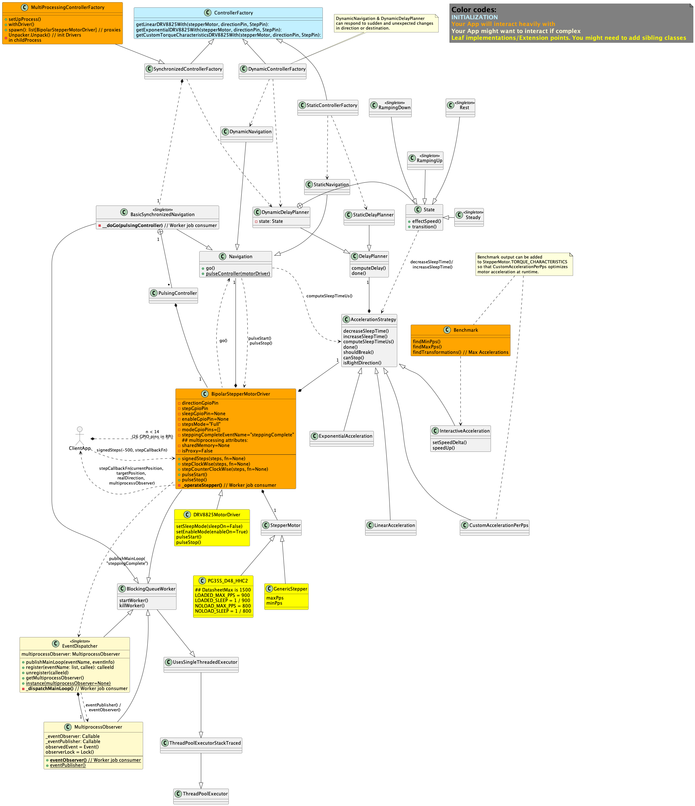

# Intro

Although Python and PC in general (RPI in particular) are not optimal for accurate timing of stepper motor pulses
(OS scheduler + Python sleep inaccuracies and, ATM, Global Interpreter Lock [GIL]), this library aims at providing
a versatile tool for managing a set of stepper motors (through their drivers) in several ways that might fit specific 
scenarios.

A few distinct concepts have been implemented:
* Driver (or Controller, used interchangeably), each instantiated driver will behave as a dedicated single thread worker
  (see `BlockingQueueWorker`) which receives steps jobs through a shared queue, in an attempt decouple steps timing 
  from the rest of the system, (here the GIL imposes some challenged in theory).
* Stepper Motor, encapsulates the motor characteristics, like min and max PPS (pulses per second), and instantaneous  
  torque. A Generic motor is implemented that can be constructed with specifics in case of lacking implementation of  
  your motor (you are welcome to add it).
* Navigation, The driver can navigate from A to B, setting direction & sending pulses to the motor, statically (as in 
  a 3D printer scenario where planning is made up front) or dynamically (for interactive or event based systems that
  need to quickly respond to unplanned speed and direction changes).
* Acceleration strategies or profiles, handle how to reach max speeds for the motor. Linear, Exponential & Custom (which
  takes motor's instantaneous torque or a list of transformations as input to max out your motor capabilities). Custom
  acceleration strategy has a pre-requisite that you use the Benchmark module (see bellow) to find optimal  
  transformations for your motor, in a production setup (proper load applied). All changes are effected as a function of
  current motor' speed in PPS. (other systems use curves as function of time. I found that impractical)
  * DelayPlanners (in tandem with Navigation modes) enable Drivers to handle inertia gracefully either in a static or 
    dynamic context. DelayPlanner implementations determine if it's time to start breaking, speeding up or stay steady.
    Acceleration strategies effect proper changes to speed. 
* Benchmark, a stress test module to find your motor's (under current load), min & max speeds, and instantaneous torque 
  characteristics, all in terms of PPS. For instantaneous torque characteristics the output (with format
  `[(minPPS, incrementPPS_1), (minPPS + incrementPPS_1, incrementPPS_2), ..., (maxPPS, 0)]`) can be
  used as `YourStepperMotorSubClass.TORQUE_CHARACTERISTICS` or as an input to `CustomAccelerationPerPps` acceleration 
  strategy's `transformations` constructor argument. This enables your motor to reach max speed in the least amount of 
  steps possible while keeping synch (useful when speed matters).
  * Currently tested on (see https://www.reddit.com/r/robotics/comments/18ukw4p/benchmarking_stepper_motor/):  
    * Raspberry Pi 4B with,
    * DRV8825 driver board
    * PG35S_D48_HHC2 stepper motor 
 

:

## Install
### Happy path

If everything works fine (on my RPI this method gets stuck.)
`pip install -i https://test.pypi.org/simple/ stepper-motors-juanmf1==0.0.2`

### Manually

Manually (find latest link at https://test.pypi.org/project/stepper-motors-juanmf1/#files copy link for 
stepper_motors_juanmf1-<latest version>-py3-none-any.whl).
Example with stepper_motors_juanmf1-0.0.2-py3-none-any.whl:
```commandline
juanmf@raspberrypi:~/turret/turret $ wget https://test-files.pythonhosted.org/packages/8b/7d/289fdee8b0a01e3c0927b9407e14803341daa0d50e65cb592de9a41581b7/stepper_motors_juanmf1-0.0.2-py3-none-any.whl
--2024-01-08 14:23:42--  https://test-files.pythonhosted.org/packages/8b/7d/289fdee8b0a01e3c0927b9407e14803341daa0d50e65cb592de9a41581b7/stepper_motors_juanmf1-0.0.2-py3-none-any.whl
...
Saving to: ‘stepper_motors_juanmf1-0.0.2-py3-none-any.whl’

stepper_motors_juanmf1-0.0.2-py3-none-any.whl      100%[================================================================================================================>]  21.98K  --.-KB/s    in 0.007s  

2024-01-08 14:23:43 (3.01 MB/s) - ‘stepper_motors_juanmf1-0.0.2-py3-none-any.whl’ saved [22507/22507]

juanmf@raspberrypi:~/turret/turret $ pip install ../
stepper_motors_juanmf1-0.0.2-py3-none-any.whl  turret/                                        
juanmf@raspberrypi:~/turret/turret $ pip install ../stepper_motors_juanmf1-0.0.2-py3-none-any.whl 
Looking in indexes: https://pypi.org/simple, https://www.piwheels.org/simple
Processing /home/juanmf/turret/stepper_motors_juanmf1-0.0.2-py3-none-any.whl
Installing collected packages: stepper-motors-juanmf1
Successfully installed stepper-motors-juanmf1-0.0.2
```

To upgrade to a newer release manually, find latest whl file as explained above, then:
now installing `stepper_motors_juanmf1-0.0.4-py3-none-any.whl`, overriding `0.0.3`
```commandline
juanmf@raspberrypi:~/turret $ pip install --upgrade stepper_motors_juanmf1-0.0.4-py3-none-any.whl
Looking in indexes: https://pypi.org/simple, https://www.piwheels.org/simple
Processing ./stepper_motors_juanmf1-0.0.4-py3-none-any.whl
Installing collected packages: stepper-motors-juanmf1
  Attempting uninstall: stepper-motors-juanmf1
    Found existing installation: stepper-motors-juanmf1 0.0.3
    Uninstalling stepper-motors-juanmf1-0.0.3:
      Successfully uninstalled stepper-motors-juanmf1-0.0.3
Successfully installed stepper-motors-juanmf1-0.0.4
```

## Usage

### Acceleration Strategies

Factory methods from `ControllerFactory` ([🔗](./src/stepper_motors_juanmf1/ControllerFactory.py)) provide easy access to
well constructed Drivers with specific acceleration profiles.


```Python3
from stepper_motors_juanmf1 import (GenericStepper, 
                                    DRV8825MotorDriver, 
                                    ExponentialAcceleration, 
                                    DynamicDelayPlanner, 
                                    DynamicNavigation,
                                    myMath) 
from time import sleep

class MyRoboticArm:
  """
  Example class using multiple driver instances (many motors).
  """
  
  def __init__(self):
    """
    Assuming you connected this motor driver's direction and step pins accordingly. 
    Step modes can also be set for micro-stepping. Tho ControllerFactory methods use only full step mode ATM.
    Sleep pin can also be set for DRV8825MotorDriver when no holding torque neeed.  
    """
    self.elbow =    MyRoboticArm.setupDriver(directionPin=23, stepPin=24) 
    self.elbowPosition = 0
    self.shoulder = MyRoboticArm.setupDriver(directionPin=14, stepPin=15) 
    self.shoulderPosition = 0
    self.hand =     MyRoboticArm.setupDriver(directionPin=25, stepPin=8) 
    self.handPosition = 0
    
    # Moving arm
    self.moveArm(elbowDelta=100, shoulderDelta=150, handDelta=200)
    sleep(0.05)
    # While still moving, Send contradictory order to arm. it should gracefully stop and 
    # speed back up in opposite direction.  
    self.moveArm(elbowDelta=-100, shoulderDelta=-150, handDelta=-200)
    
  def elbowPositionListener(self, currentPosition, targetPosition, direction):
    self.elbowPosition = currentPosition
    
  def shoulderPositionListener(self, currentPosition, targetPosition, direction):
    self.shoulderPosition = currentPosition
    
  def handPositionListener(self, currentPosition, targetPosition, direction):
    self.handPosition = currentPosition
    
  def moveArm(self, elbowDelta, shoulderDelta, handDelta):
    # moving the motors
    if elbowDelta != 0:
      # Non blocking, sends step job to driver worker,
      if myMath.sign(elbowDelta) == 1:
        self.elbow.stepClockWise(elbowDelta, self.elbowPositionListener)
      else:
        self.elbow.stepCounterClockWise(elbowDelta, self.elbowPositionListener)
    
    if shoulderDelta != 0:
      # Non blocking, sends step job to driver worker,
      if myMath.sign(shoulderDelta) == 1:
        self.shoulder.stepClockWise(elbowDelta, self.shoulderPositionListener)
      else:
        self.shoulder.stepCounterClockWise(elbowDelta, self.shoulderPositionListener)

    if handDelta != 0:
      # Non blocking, sends step job to driver worker,
      if myMath.sign(handDelta) == 1:
        self.hand.stepClockWise(handDelta, self.handPositionListener)
      else:
        self.hand.stepCounterClockWise(handDelta, self.handPositionListener)
                           
  @staticmethod
  def setupDriver(*, directionPin, stepPin):
    stepperMotor = GenericStepper(maxPps=2000, minPps=150)
    delayPlanner = DynamicDelayPlanner()
    navigation = DynamicNavigation()
    
    acceleration = ExponentialAcceleration(stepperMotor, delayPlanner)
    # Important to set this reference once you have acceleration instance! 
    delayPlanner.setAccelerationStrategy(acceleration)
    return DRV8825MotorDriver(stepperMotor, acceleration, directionPin, stepPin, navigation)

```

Alternative moveArm implementation verion >0.0.8:
```Python
def moveArm(self, elbowDelta, shoulderDelta, handDelta):
    # moving the motors; encapsulating signed and zero delta logic in `signedSteps` 
    self.elbow.signedSteps(elbowDelta, self.elbowPositionListener)
    self.shoulder.signedSteps(shoulderDelta, self.shoulderPositionListener)
    self.hand.signedSteps(handDelta, self.handPositionListener)
        
```

#### ExponentialAcceleration

In this example we use `ExponentialAcceleration`, which exponentially decreases increments as PPS goes up in a `RampingUp` 
state behaves as follows ([see this to play around](https://www.desmos.com/calculator/luvnt6dtae)):

In linked simulation, current speed is `a`, marked by `x=a` fn for visual aid. Intersection between Identity fn `x=x` 
and `x=a` shows how large is the jump in PPS to next speed, either when `RampingUp`(Fn1, in red) or `RampingDown`(Fn2, 
in black).

In the following desktop test, black dot shows `(currentSpeed, nextSpeed)` or `F(currentPPS) -> nextPPS`. 

I try to feed F1 with nextPPS iteratively to simulate acceleration process that takes place at run time.
In this case with `minSpeed=200 PPS` and `maxSpeed=900 PPS` it'd take **6 steps to reach max speed** using 
`ExponentialAcceleration` with initial acceleration factor of (`b=2`).
 
`Fn1(PPS) -> PPS = a * b ** (1.01 - (x / c))`; `c=maxPPS`; `a=currentPPS`; `b=initialSpeedUpFactor`

> Starting at minPPS of 200, ramping Up, uses Fn1(200 PPS) -> 345 PPS
> So next speed will be 345 PPS...

> (approximating 345 with 350) 
> 350 PPS -> 538 PPS 

> (approximating 538 with 500, yes, 550 was closer...) 
> 500 PPS -> 685 PPS

> (approximating 685 with 700) 
> 700 PPS -> 822 PPS 

> 850 PPS -> 889 PPS

> 900 PPS -> 906 PPS
> ExponentialAcceleration limits speeds to maxPPS so this would get stuck at 900 PPS
 
Effectively following this set of curves, [for speed up and slow down](https://www.desmos.com/calculator/ruorm9qqhn):

Note that identity `x=x`, speedUp and slowDown curves intersect at zero and maxPPS, effecting no change in speed once 
current speed hits these extreme values.

### tPrint

When you have many `BlockingQueueWorker`s executing your callables, printing to `STD_OUT` can get messy.
there are utility functions in `ThreadOrderedPrint.py` to help organize print output.

```Python
from stepper_motors_juanmf1.ThreadOrderedPrint import tprint, flush_streams

    def callableThatPrints(self, elbowDelta, handDelta):
        tprint("computePolarDelta")
        tprint("rowOrAzimuthDelta, colOrElevationDelta")
        tprint(elbowDelta, handDelta)
        tprint("")
```

This will store the `print()` output in a thread based stream file. When you are ready to dump output: `flush_streams()`
Will dump threads output and delete buffers.
Output will be timestamped to the micro second uS (no date). for comparison with other thread's output.
```commandline
@start thread dump 2930762816_ThreadPoolExecutor-7_0 ========================================
======================================================================
[17:31:49.992524] dispatchMainLoop
[17:31:49.992575] eventName, eventInfo
[17:31:49.992612] AimingComplete {'isReady': True}
...
@end thread dump =====================================================

@start thread dump 2922370112_ThreadPoolExecutor-8_0 ========================================
======================================================================
[17:31:49.856784] Setting direction pin 23 1.
[17:31:49.856912] State Rest -> RampingUp
[17:31:49.862105] fireReadyEvent
...
@end thread dump =====================================================
...
```

### Benchmark
for CLI Benchmark, you need download sources and cd to `src/stepper_motors_juanmf1/`
start gpio demon on your Raspberry Pi and start benchmark passing step and direction pins per your setup.
```
$ cd src/stepper_motors_juanmf1
$ sudo pigpiod -s 10 -t 0
$ python3 Benchmark.py 23 24

# you can use `netstat netstat -tulpn` to check pigpiod demon 
#  is listening, in my case on `tcp6       0      0 :::8888` 
```
Annotated (`# <== `) output:
```
Benchmarking azimuth Motor
Setting direction pin 23 0.


Process has 4 steps, needs human feedback. Make sure you apply relevant load to the motor.
1) Find min PPS at which the motor show continuity between steps.
2) Find max PPS motor acn keep up with, this by using modest acceleration so might be slow.
3) Starting from minPPS will try to jump to greatest next PPS that you observe not to fail with.
4) after repeating 3 until maxPPS is reached, dump the data in a format compatible with stepperMotors.CustomAccelerationPerPps.transformations

picked['picked']: False
decreaseSleepTime: pps: 150.
decreaseSleepTime: TargetSleep: 0; currentSleepTime: 6666.666666666667.
CurrentPPS: 155.0                                    # <== initial PPS incremented by minimum delta.
decreaseSleepTime: pps: 155.0.
decreaseSleepTime: TargetSleep: 0; currentSleepTime: 6451.612903225807.
CurrentPPS: 160.0                                    # 'up pressed '<== increments by minimum delta.
decreaseSleepTime: pps: 160.0.
Enter pressed, setting picked True!!!                # < === picked min speed by pressing enter.
# < === <ommited a few lines>
Successfully stopped motor.
Successfully stopped motor.                          # < === <ommited a few lines>  

Setting direction pin 23 0. 
SEARCHING FOR MAX PPS.                               # < === search for max speed starts, wait till motor fails and 
                                                     # press enter ASAP, (have about 0.5 seconds before it keeps increasing speed)                               
decreaseSleepTime: pps: 150.
decreaseSleepTime: TargetSleep: 0; currentSleepTime: 6666.666666666667.
CurrentPPS: 155.0
decreaseSleepTime: pps: 155.0.
decreaseSleepTime: TargetSleep: 0; currentSleepTime: 6451.612903225807.
CurrentPPS: 160.0
decreaseSleepTime: pps: 160.0.
decreaseSleepTime: TargetSleep: 0; currentSleepTime: 6250.0.
CurrentPPS: 165.0
decreaseSleepTime: pps: 165.0.
decreaseSleepTime: TargetSleep: 0; currentSleepTime: 6060.606060606061.
CurrentPPS: 170.0
...
Enter pressed, setting picked True!!!               # < === picked maxPPS (system uses previous PPS to falure, you might 
                                                    # want to give it a margin.)
# < === <ommited a few lines>

Successfully stopped motor.
Successfully stopped motor.

speedBoosts: [(165.0, 5)]

Setting direction pin 23 1.
State Rest -> RampingUp
State RampingUp -> RampingUp
decreaseSleepTime: TargetSleep: 5882.35294117647; currentSleepTime: 6060.606060606061.
pos: 0; self.transformations [(165.0, 5)]
pos: 1; self.transformations [(165.0, 5)]
State RampingUp -> Steady
PASSED speed boost: cPPs: 170 last Speed: 165.0
Restarting cycle.
Doubling Delta: new delta: 10

FINDING SPEED BOOSTS FOR MOTOR.                     # < === from here press 'y' or 'n' & 'enter' to pick speed increments
                                                    # from minPPS to maxPPS

State Steady -> RampingDown
increaseSleepTime: TargetSleep: 6060.606060606061; currentSleepTime: 5882.35294117647.
pos: 1; self.transformations [(165.0, 10)]
resetStoppingFlag: currentPosition: 3526, targetPosition: 3526
Successfully stopped motor.
Successfully stopped motor.

Setting direction pin 23 0.

speedBoosts: [(165.0, 10)]

Setting direction pin 23 1.
State Rest -> RampingUp
State RampingUp -> RampingUp
decreaseSleepTime: TargetSleep: 5714.285714285715; currentSleepTime: 6060.606060606061.
pos: 0; self.transformations [(165.0, 10)]
pos: 1; self.transformations [(165.0, 10)]
State RampingUp -> Steady
PASSED speed boost: cPPs: 175 last Speed: 165.0
Restarting cycle.
Doubling Delta: new delta: 20

FINDING SPEED BOOSTS FOR MOTOR.

resetStoppingFlag: currentPosition: 3666, targetPosition: 3670
resetStoppingFlag: currentPosition: 3667, targetPosition: 3670
resetStoppingFlag: currentPosition: 3668, targetPosition: 3670
resetStoppingFlag: currentPosition: 3669, targetPosition: 3670
State Steady -> RampingDown
increaseSleepTime: TargetSleep: 6060.606060606061; currentSleepTime: 5714.285714285715.
pos: 1; self.transformations [(165.0, 20)]
resetStoppingFlag: currentPosition: 3670, targetPosition: 3670
Successfully stopped motor.
Successfully stopped motor.

Setting direction pin 23 0.

speedBoosts: [(165.0, 20)]
...
Ending the Search. max speed reached. currentPps: 185; maxPps: 185.0accelerationStrategy: CustomAccelerationPerPps

Found next speed boost of 15, for pps 165.0
speedBoosts: [(165.0, 15), (180.0, 0)]


pos: 1; self.transformations [(165.0, 15), (180.0, 0)]
transformations exact match: 180.0
State RampingUp -> Steady
resetStoppingFlag: currentPosition: 3673, targetPosition: 3677
Results===========================================================================
MinSpeed PPS: 165.0; MaxSpeed PPS: 180.00000000000003
optimal transformations for your motor with current load:
[(165.0, 15), (180.0, 0)]                                    # < === use this list as input to CustomAccelerationPerPps 

Same data to play in a spreadsheet
PPS	SpeedDelta PPS
165.0	15
180.0	0
```
Will clean up output shortly.

Using `Benchmark` from outside the module
```Python
from stepper_motors_juanmf1.StepperMotor import GenericStepper
from stepper_motors_juanmf1.Benchmark import Benchmark


class Training:

    @staticmethod
    def main():
        args = sys.argv[1:]
        if len(args) > 0 and args[0] == "bench":
            print("Benchmarking Motor")
            motor = GenericStepper(maxPps=2000, minPps=190)
            
            Benchmark.initBenchmark(motor, directionPin=23, stepPin=8)
        

if __name__ == '__main__':
    Training.main()
```
usage:
```commandline
$ sudo pigpiod -s 10 -t 0 
$ python3 ./Training.py bench

```

## Contributing

Reminder of release steps for contributor.
**Don't forget to bump version in pyproject.toml** otherwise you can't upload package to package index (repeated 
file name).

```commandline
# work station:
$ git commit -am"last change description" && git push

# might need PR to send changes to main repo?

# raspberry pi cd to repository dir.
$ git pull
$ rm ./dist/*
$ python3 -m build
* Creating venv isolated environment...
* Installing packages in isolated environment... (RPi.GPIO, hatchling, numpy, pigpio, sshkeyboard)
* Getting build dependencies for sdist...
* Building sdist...
* Building wheel from sdist
* Creating venv isolated environment...
* Installing packages in isolated environment... (RPi.GPIO, hatchling, numpy, pigpio, sshkeyboard)
* Getting build dependencies for wheel...
* Building wheel...
Successfully built stepper_motors_juanmf1-0.0.7.tar.gz and stepper_motors_juanmf1-0.0.7-py3-none-any.whl


# Next step I do from workstation if it fails from RPI. 
# So optionally at workstation:
$ scp <user>@raspberrypi.local:/<projectDir>/dist/* /<projectDir>/dist/

# Then upload to index
$ python3 -m twine upload --repository testpypi dist/*

# then reinstall on RPI:
$ pip install --upgrade -i https://test.pypi.org/simple/ stepper-motors-juanmf1

# Alternatively can install on RPI directly from whl package, to test before uploading to Index.
$ pip install --upgrade ./dist/stepper_motors_juanmf1-<latest>-py3-none-any.whl
```